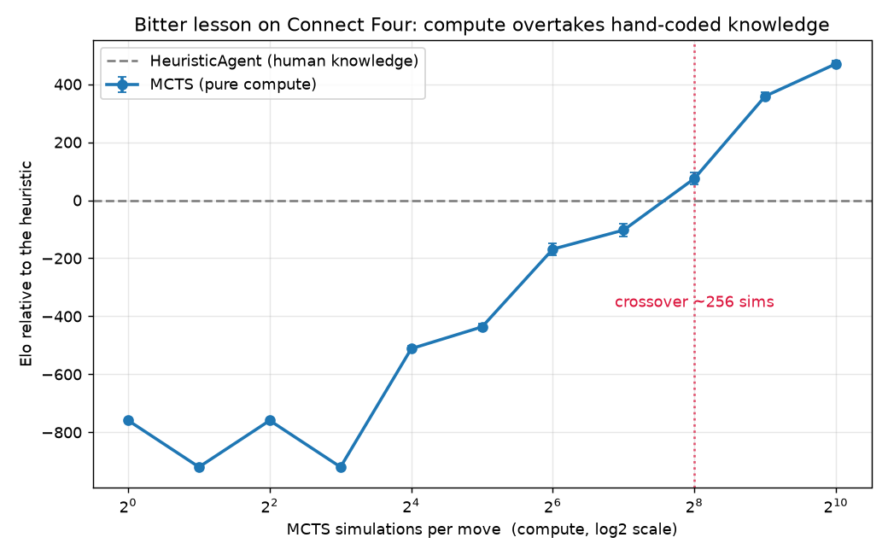

# Bitter Lab

A small Connect Four project for learning how machine-learning systems really work, by
building one and measuring it.

**Read the full walkthrough: [TUTORIAL.md](TUTORIAL.md).** It's plain, illustrated, and
written for anyone with basic Python. This README is just the quick tour.


## The idea

There are two ways to make a computer good at a game. You can teach it good moves by hand (call
it the expert), or you can give it only the rules and let it think (call it the thinker). A
famous claim in AI, the "bitter lesson," is that with enough computing power the thinker wins.
This project shows that happening on a board you can watch, then asks the question that actually
matters once you leave the textbook: thinking costs time and energy, so when is it worth it?

## What it shows



- **Thinking beats knowing.** A thinker that knows only the rules loses every game at 8
  simulations, then overtakes the hand-coded expert at around 256 and wins almost every game by
  1024. (`run_crossover.py`)
- **But thinking isn't free.** Storing the board as bits instead of a grid made it 2.6 times
  faster, each doubling of thinking buys less skill than the last (it flatlines), and on a tight
  per-move clock (under about 20 ms) the cheap expert wins again. (`run_efficiency.py`)
- **It can learn on its own.** A small value network trained only on the agent's own games
  beats the random-rollout thinker about 69% of the time at equal thinking, and beats the expert
  too, with no strategy ever programmed in. (`run_selfplay.py`)

## What's here

| File | What it does |
|------|--------------|
| `engine.py` | The Connect Four game and its rules. No AI. |
| `bitboard.py` | The same game stored as bits, for speed. Same interface as `engine.py`. |
| `agents.py` | The players: random, the hand-coded expert, and the thinker (MCTS). |
| `valuenet.py` | A tiny value network (NumPy) that judges a position. |
| `selfplay.py` | Generates self-play games to train the network. |
| `tournament.py` | Plays players against each other and counts wins. |
| `elo.py` | Turns win rates into a single skill number. |
| `viz.py` | Draws all the diagrams in `figures/`. |
| `experiments/run_crossover.py` | Thinking vs knowing: the crossover. |
| `experiments/run_efficiency.py` | Speedup, diminishing returns, the budget flip. |
| `experiments/run_selfplay.py` | Learning from self-play. |
| `tests/` | Checks the engine and bitboard agree, and the network learns. |
| `figures/` | Generated charts and diagrams. |
| `TUTORIAL.md` | The full illustrated walkthrough (start here). |

## Run it yourself

```bash
python3 -m venv .venv && source .venv/bin/activate
pip install numpy matplotlib pytest

pytest tests/                          # check the rules and the bitboard
python experiments/run_crossover.py    # thinking overtakes knowing
python experiments/run_efficiency.py    # the cost side: speedup, limits, the budget flip
python experiments/run_selfplay.py     # learning from self-play
python viz.py                          # redraw the diagrams
```

The code is small and meant to be read. `engine.py` is the game, `agents.py` is the three
players, and the `experiments/` scripts produce every number above.

## About

This is part of working through Harvard's open [Machine Learning Systems](https://mlsysbook.ai)
book, one experiment at a time. It's the first in a series, with more reads and experiments to
come.
