# Watch a computer learn Connect Four

I kept reading about "the bitter lesson" in AI. It's the idea that general methods which
use more computation beat methods where people hand-code their knowledge. I didn't want to just
take their word for it. I wanted to build it and check. So I built it on the smallest game I
could think of: Connect Four.

One player knows good moves. The other knows only the rules and just thinks. I turned up how
hard the second one is allowed to think, and watched it overtake the first. Then I asked the
question that matters once you leave the textbook: thinking costs time and energy, so
when is it worth it? On a tight clock, the cheap hand-coded player wins again. And finally I
let a player learn from its own games, with no strategy given to it at all, and watched it get
good on its own.

This whole project came out of reading Harvard's open book
[Machine Learning Systems](https://mlsysbook.ai). I'm going through it one idea at a time, and
this is the first. You only need basic Python to follow along,
everything is in the repo, and every picture is drawn from code.

---

## Two ways to be good at a game

Say you want a computer to play a game well. You have two options.

Option one: tell it the good moves yourself. You know that the center is strong, that three in
a row is a threat, so you write that down as rules. Call this player **the expert**.

Option two: tell it only the rules of the game, and let it figure out the rest by trying
things. Call this player **the thinker**.

Option one feels smarter. It usually loses. That is the bitter lesson, and the rest of this
post is me showing it to myself.

---

## The game

Connect Four is played on a standing grid, 7 columns wide and 6 rows tall.

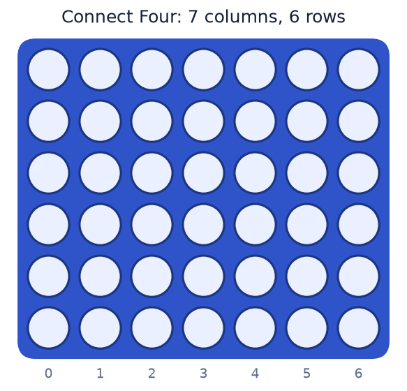

You take turns dropping discs into columns. You pick the column. Gravity picks the row: the
disc falls to the lowest empty slot.

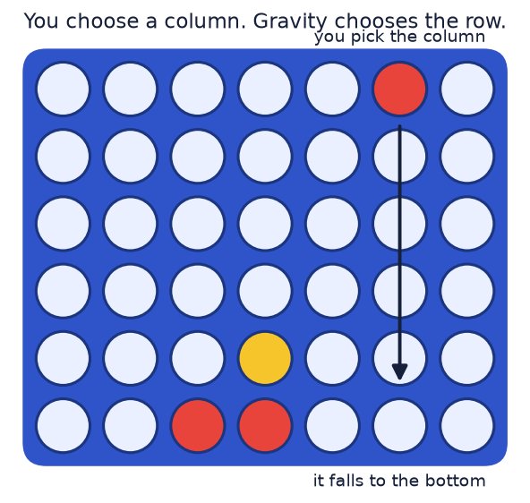

You win the moment you get four of your discs in a line, in any direction: across, up, or
along either diagonal.

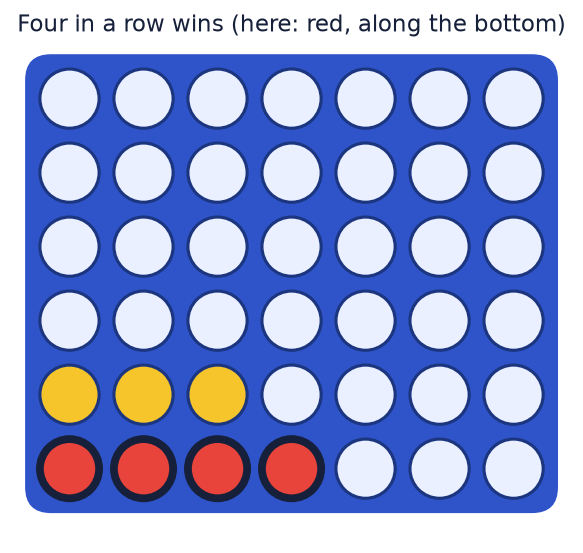

That's the whole game. A child learns it in a minute. I picked it for three reasons:

- It's small. At most 7 moves are possible per turn, so a computer can explore the choices on
  a laptop.
- It's solved. Back in 1988 it was proven that the first player can always win with perfect
  play, and the best opening is the center column. So when my expert "prefers the center," that's
  not a cheap trick. The center really is the best opening move. The expert is genuinely strong.
- There's no luck and nothing hidden. Both players see everything. So when one player beats
  another, it's about decisions, not dice.

---

## Building the board

The board is a grid of numbers: 0 for empty, 1 for red, 2 for yellow. Dropping a disc means
finding the lowest empty cell in a column and putting your number there.

The interesting part is checking for a win. When you drop a disc, the only new line it could
make is one that runs through that disc. So you don't scan the whole board. You stand on the
new disc and look outward in each direction, counting your own colour:

```python
# starting from the cell just played, count your discs each way
count = 1 + run(direction) + run(opposite_direction)
if count >= 4:
    you_win()
```

That's it for the rules. This part is plain, predictable code: the same board always gives the
same answer, so I could write tests for every rule and trust them completely. That matters
later, because once I add players that think and learn, this is the one piece I never have to
doubt.

> 🤔 **What surprised me.** My first test needed a full board with no winner (a draw). I
> hand-drew one I was sure had no four in a row. The test failed. It turns out my pattern had a
> diagonal four I hadn't spotted. I gave up eyeballing it and wrote six lines to search for a
> real draw position. A dumb search found one instantly. That's the bitter lesson in miniature,
> before I'd even written a player.

---

## Player one: the expert

The expert plays with knowledge I gave it. Its rules, in order:

```text
1. If a move wins right now, play it.
2. Otherwise, if the opponent could win next turn, block that.
3. Otherwise, play the move that leaves the best-looking board.
```

For step 3 it needs to judge a board. It does this by looking at every group of four cells in a
line and scoring it: more of my discs (with room to finish) is good, an almost-complete enemy
line is bad, central discs are worth a little extra because they touch more lines.

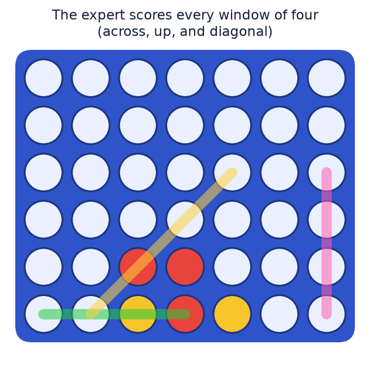

This expert is good, and it's fast. It barely looks ahead. That speed matters later.

---

## Player two: the thinker

The thinker knows none of that. It knows only the rules. So how can it play well?

The honest problem first: it can't just look ahead to the end of the game. Every move you make
opens up 7 replies, and each of those opens up 7 more. The number of futures explodes.

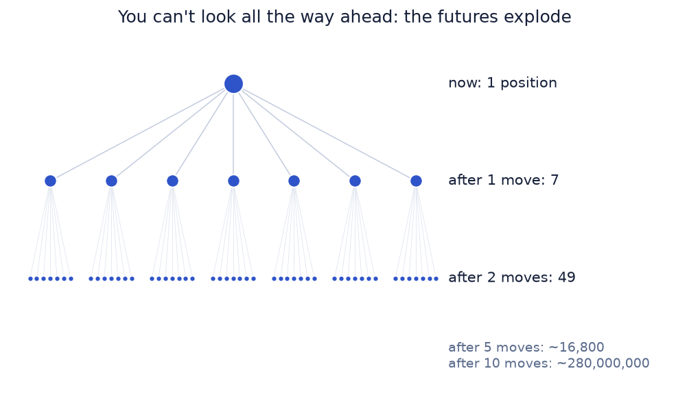

After ten moves there are hundreds of millions of positions. You cannot check them all. So the
thinker cheats.

To judge a move, it picks that move and then **finishes the game with random moves for both
sides**, all the way to the end, and sees who won. One random game tells you almost nothing.
But play a few hundred from the same starting move, and a pattern shows up: good moves win
their random games more often than bad ones. The thinker just counts.

It's also careful about where it spends those games. Instead of giving every move the same number of random
games, it keeps a small tree of what it has tried and spends more games on the moves that look
promising, while still occasionally checking the ones it has ignored. One round of this has
four steps:

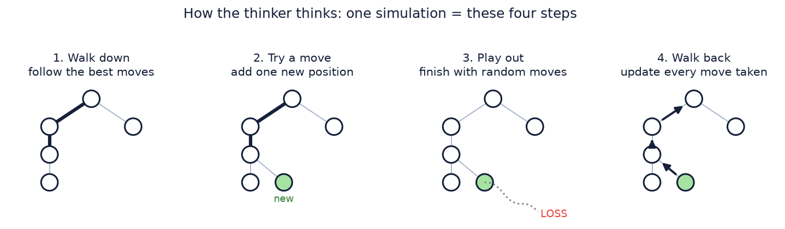

In code, one move is just this loop, run as many times as you can afford:

```python
for _ in range(simulations):
    node   = walk_down(root)         # follow promising moves to a fresh spot
    node   = add_one_child(node)     # try a move we haven't tried here
    winner = play_out_randomly(node) # finish the game with random moves
    walk_back(node, winner)          # update every move along the way
play(most_visited_move(root))
```

The only knob is `simulations`: how many times it runs that loop before moving. That number is
the "thinking." It's also, literally, the amount of computation it does. Nothing about Connect
Four strategy is in here. Strength comes only from doing more loops.

> 🤔 **What surprised me.** Getting the bookkeeping right was the whole battle. Each spot in the
> tree has to record results from the point of view of the right player. I had the sign flipped
> at first, and the thinker confidently played the opponent's best move instead of its own. The
> tell was a quick test: a thinker doing 100 loops should crush a random player. When it did, I
> knew the signs were right.

---

## The showdown

Now the experiment. I let the thinker play the expert many times, giving the thinker more
simulations each round, and measured how often it won. I turned the win rate into a single
skill number (the chess rating idea, Elo), with the expert fixed at zero. Above zero means the
thinker is winning. (The Elo formula is in the appendix.)


At 8 simulations the thinker loses every single game. At 64 it's still losing. Somewhere around
256 simulations it crosses the line and starts beating my hand-coded expert. By 1024 it wins
almost every game.

The player that knows nothing about Connect Four beats the player full of my
carefully written knowledge, just by being allowed to think more. I didn't make the thinker
smarter. I gave it more compute. That's the bitter lesson, on my laptop, in one curve.

---

## But thinking isn't free

Here's the part the headline version of the bitter lesson skips. Thinking costs time and
energy. "Just think more" is only free advice if compute is free, and it never is. So I spent
the second half of this project measuring the cost.

### Where does the time go?

Before optimizing anything, I checked where the time actually went, by profiling one move of
the thinker. Almost all of it was in the win check and finding legal moves, called hundreds of
thousands of times. No surprises, no hidden waste. Good. Now I know what to make faster.
(This is the iron law of ML systems at work. The formula, and why our game collapses to just
one of its three terms, is in the appendix.)

### Make each thought cheaper

The board was a grid of numbers. I rewrote it as two plain integers, where each cell is one bit.

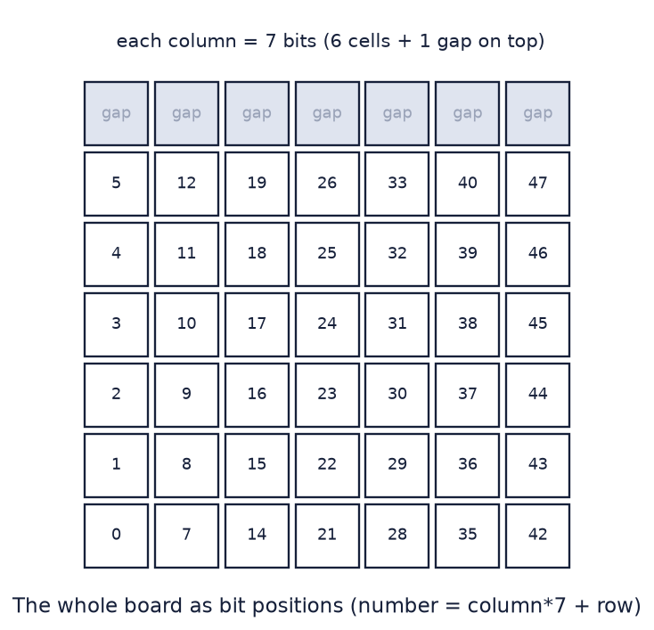

This sounds like a downgrade until you see what it buys. Copying a position is now copying two
numbers instead of a 42-cell grid, and the thinker copies positions constantly. And the win
check becomes a handful of bit shifts:

```python
def four_in_a_row(pieces):          # pieces = one player's discs, as bits
    for step in (1, 7, 8, 6):       # up, across, and the two diagonals
        m = pieces & (pieces >> step)
        if m & (m >> 2 * step):
            return True
    return False
```

Same game, same rules, checked against the simple version on 300 random games to be sure. It
ran **2.6 times faster**. The lesson is the boring one that's always true: profile first, then
make the hot part cheap.

### Each extra thought helps less than the last

Does twice the thinking give you twice the skill? No. I laddered the thinker against itself: 32
simulations versus 64, 64 versus 128, and so on, measuring how much skill each doubling bought.

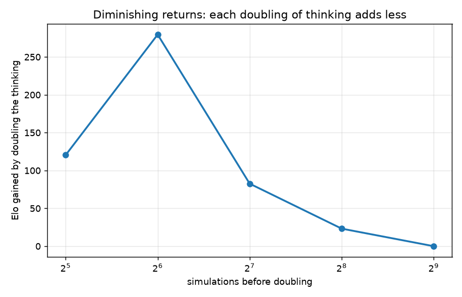

Each doubling adds less than the one before, until it adds nothing at all: going from 512 to
1024 simulations wins exactly half its games. It flatlines. (This curve is the return on
compute, and the formula with these exact numbers is in the appendix.) Why? Random play-outs
are a weak, noisy signal, and past a point, more of them stops sharpening the
estimate. More play-outs can average out the luck, but they can't make each individual guess
any smarter. To improve, the play-outs themselves have to get better. (Hold that thought. It's
the whole reason for the last section.)

### On a tight clock, the cheap expert wins again

Here's my favorite result. I put both players on a per-move time budget and varied it.

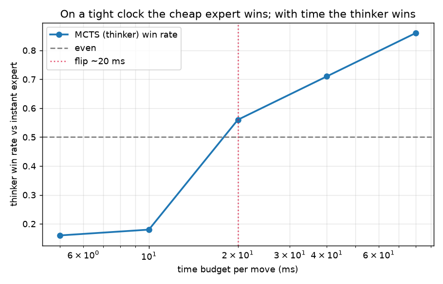

Give each player only 5 milliseconds per move and the instant, cheap expert wins easily, because
the thinker can't do enough loops to find anything. Give them 20 milliseconds and it flips:
now the thinker has time to think, and it takes over.

Same two players. Opposite winners. The only thing that changed is the compute budget. This is
the real shape of the trade. Scale wins when you can afford it. When you can't, on a tiny device
or under a tight deadline, cheap knowledge is the right call. A "better" method that you can't
afford to run is not better. And making your code faster (that 2.6x) shifts that flip earlier:
the same speedup lets scale start winning on a tighter budget than before.

---

## Teach it to learn

Back to that flatline. The thinker stalled because random play-outs are a weak signal. So what
if, instead of finishing games with random moves, the player used something it *learned* about
which positions are good?

So I gave it a small network: board in, one number out, between -1 (losing) and +1 (winning).

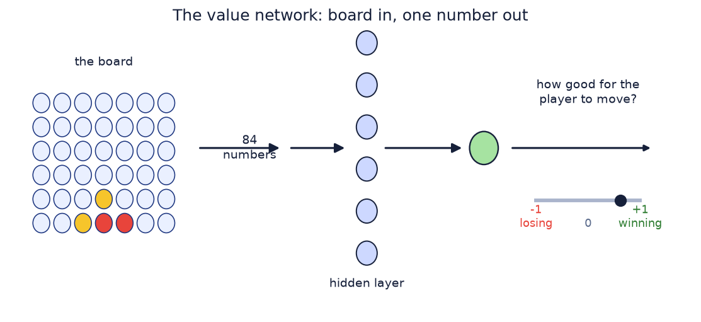

Nothing about strategy is programmed into it. It learns the only honest way available: the
player plays games against itself, and every position gets labeled by who eventually won that
game. The network trains to predict those labels. Better predictions make better play, which
makes better games to learn from, and around it goes. This is the idea behind AlphaGo and
AlphaZero, shrunk to fit a laptop.

> 🤔 **What surprised me, twice.** My first runs were a mess. The network's predictions improved,
> but plugged into the search it *lost* to plain random play-outs. Confusing. So I ran one
> check: I fed the search a known-good judgment of positions (the expert's own scoring) instead
> of the network. That version beat random play-outs in about 82% of games at equal thinking (49 of 60).
> So the machinery was fine. The network just wasn't good enough yet. The fix was just more
> scale: more self-play games, and more thinking per move to get cleaner labels. Random
> play-outs turned out to be a surprisingly strong baseline, and beating them took real volume.

With enough self-play games, here's the learning curve. I measured the learner against the
random-play-out thinker at the **same** number of simulations, so any difference is the quality
of the learned judgment, not extra compute.

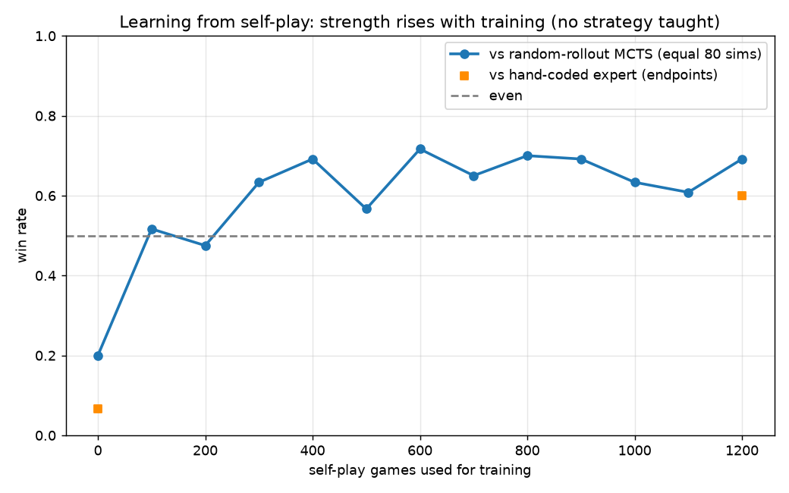

It starts below random play-outs (an untrained network is worse than coin-flips). Around a
hundred games it catches up. By a few hundred it's winning two games out of three against the
random-play-out player at equal thinking. It beats my hand-coded expert too, with far fewer
simulations than the random-play-out player needed just to draw level with that expert. It taught itself, from nothing but its
own games, to be stronger per unit of compute than both the searcher and my knowledge.

---

## What it all means

The first half is Sutton's bitter lesson: a method that only knows the rules, given enough
compute, beats the knowledge I carefully hand-wrote. The second half is the part that makes it
engineering instead of a slogan:

- Skill grows with the **logarithm** of compute, not in a straight line. Each doubling buys
  less. There's a flatline.
- Compute costs time and energy, so the right amount of it depends on your budget. On a tight
  clock, cheap knowledge wins. A better method you can't afford to run isn't better.
- Cheaper compute (the bitboard) just raises the ceiling. You spend the savings on more
  scale.
- And learning is itself bound by scale. A learned signal can beat a hand-built one, but only
  with enough data and compute to get good. Below that, a strong simple baseline wins.

That tension, "scale wins, but only as far as you can pay for it," is the everyday reality of
building machine-learning systems. It's also exactly why so much of the field is about
efficiency: getting more skill out of each dollar and each watt of hardware. The bitter lesson
tells you scale matters. The rest of the work is being able to afford it.

---

## Try it yourself

Everything is in the repo. To reproduce the charts:

```bash
python3 -m venv .venv && source .venv/bin/activate
pip install numpy matplotlib pytest

pytest tests/                          # check the game rules
python experiments/run_crossover.py    # the bitter-lesson crossover
python experiments/run_efficiency.py   # speedup, diminishing returns, the budget flip
python experiments/run_selfplay.py     # learning from self-play
python viz.py                          # redraw the diagrams
```

The code is small and meant to be read: `engine.py` is the game, `agents.py` is the three
players, and the `experiments/` scripts produce every number in this post.

---

## Appendix: the equations, and our numbers in them

You don't need any of this to get the story. But each idea above has a real formula behind it,
and it's satisfying to put our own measured numbers inside them. These are the same equations
the machine-learning-systems world uses on real models. We just got to see them on a board game.

### 1. The iron law (how long anything takes)

The time to run any machine-learning task splits into three parts: moving data, doing the math,
and a fixed tax.

$$
T \;\approx\; \underbrace{\frac{\text{Data}}{\text{Bandwidth}}}_{\text{move the bytes}} \;+\; \underbrace{\frac{\text{Ops}}{\text{Peak} \times \eta}}_{\text{do the arithmetic}} \;+\; \underbrace{\text{Overhead}}_{\text{fixed cost}}
$$

- `Data` is the bytes you move, `Bandwidth` is how fast you can move them.
- `Ops` is the number of arithmetic operations, `Peak` is the chip's top speed, and `η` (eta)
  is how much of that top speed you actually reach.
- `Overhead` is the fixed costs that don't shrink, like setup and scheduling.

The formula matters less than the one question it forces you to ask: which term is the biggest?
For Connect Four I profiled it, and the answer was clear. There's almost no data to move and
almost no fixed overhead. Nearly all the time is arithmetic, in the win checks and move
generation. So the whole thing collapses to the middle term, and the only way to go faster is
to make that arithmetic cheaper. That's exactly what the bitboard did.

Slice 3 flips it in a fun way. The value network is tiny: about 22,000 operations per call
(84 by 128 in the first layer, 128 by 1 in the second). That math is nothing. But it gets
called one position at a time, and one-at-a-time the fixed per-call cost (the `Overhead` term)
is what dominates, not the arithmetic. That's the whole reason I wrote the network in plain
NumPy instead of a big framework: when the math is tiny, you optimize the overhead, not the
operations.

### 2. Return on compute (is more worth it?)

Every extra bit of computing power buys you some extra skill. Return on compute is just
skill-gained divided by compute-added.

$$
\text{return on compute} \;=\; \frac{\Delta\,\text{skill}}{\Delta\,\text{compute}}
$$

Our ladder measured exactly this, with skill in Elo and compute as the number of simulations.
Each row is one doubling:

| doubling the simulations | Elo gained |
|---|---|
| 32 → 64 | +120 |
| 64 → 128 | +280 |
| 128 → 256 | +83 |
| 256 → 512 | +23 |
| 512 → 1024 | +0 |

The return shrinks toward zero. By the last doubling you pay twice the compute and get nothing
back. That number is what tells you when to stop scaling, and it's the quiet warning sitting
inside the bitter lesson.

### 3. Elo (turning wins into a skill number)

If you know two players' ratings, Elo predicts how often the stronger one wins.

$$
E_A \;=\; \frac{1}{1 + 10^{\,(R_B - R_A)/400}}
$$

A 400-point gap means the favorite wins about 90% of the time. We also needed the reverse:
given an observed win rate, what rating gap does it imply? That's the same formula turned
around.

$$
\text{rating gap} \;=\; 400 \cdot \log_{10}\!\left(\frac{p}{1 - p}\right)
$$

Here `p` is the win rate. A 50% win rate gives a gap of 0 (evenly matched), and 60% gives about
+70. This is the function in `elo.py` that turned every match result into the numbers on every
chart.

### Where this goes at full scale

Two more from the same family. We didn't need them on a laptop, but they run the real world.

- **Energy** looks like the iron law, but for joules instead of seconds:
  $E \approx \text{Data} \times (\text{energy per byte}) + \text{Ops} \times (\text{energy per op})$. In big models the data-movement term
  dominates, which is why shuffling weights around, not the arithmetic, burns most of the power.
- The thing systems engineers actually optimize is **skill per dollar**, roughly
  $\dfrac{\text{model size} \times \text{data size}}{\text{hardware efficiency}}$. The bitter lesson says scale wins. This is
  the equation that decides whether you can afford it.

That's the bridge from a board game on a laptop to why a data center is shaped the way it is.

---

## What's next

This is the first in a series. I'm working through the rest of
[Machine Learning Systems](https://mlsysbook.ai) the same way: one idea at a time, built small
enough to see and measured instead of taken on faith. More reads and experiments are on the way.
